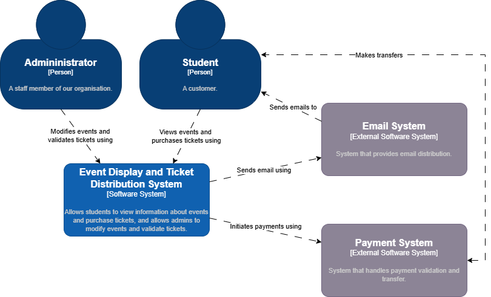
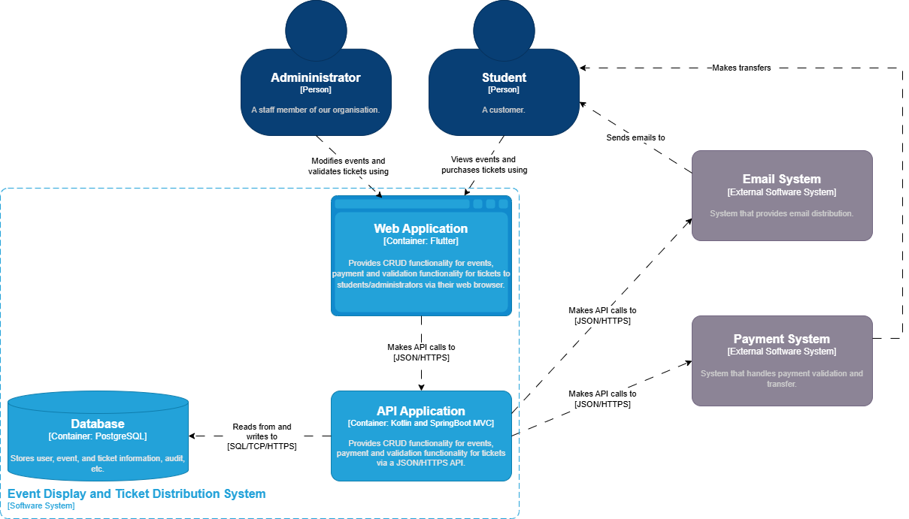
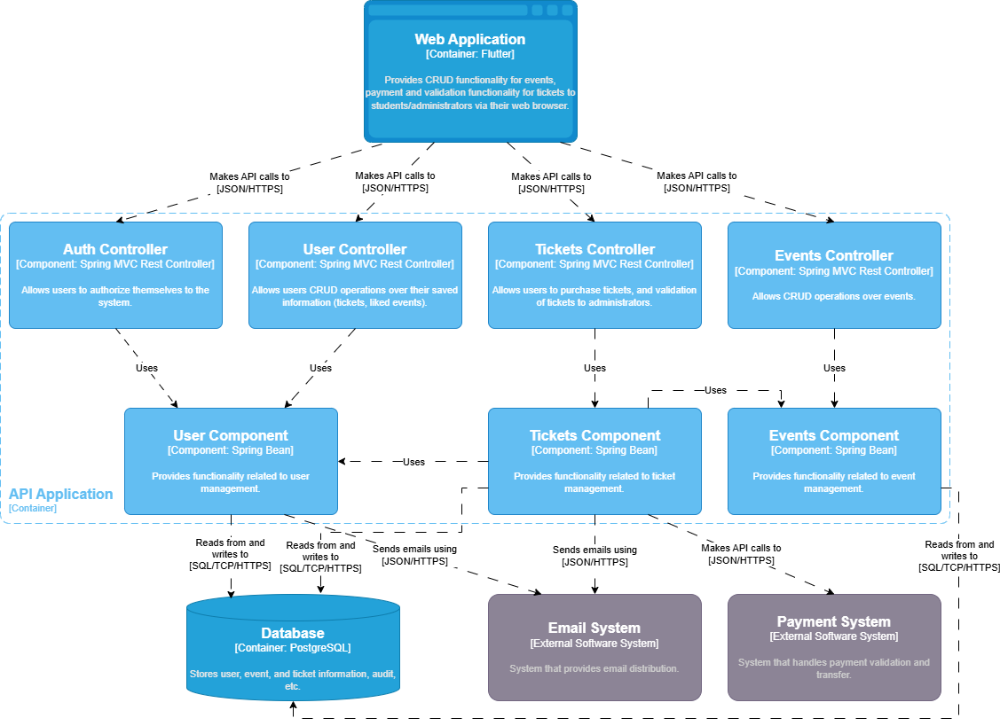

# [Name] project architectural decisions

## Introduction

The project is a web-based ticketing platform designed to allow university students to view and purchase tickets for various events. The platform also provides administrative tools for event organizers to create, manage, and validate tickets. The system incorporates email delivery and payment integration.

This document outlines key architectural decisions and presents an overview of the system's structure based on the C4 model at C1, C2, and C3 levels.

## Architecture overview

### System Context (C1)

At the highest level, the system consists of a central **Event Display and Ticket Distribution System** used by two types of users:

- **Students**, who register, browse events, purchase tickets, and receive QR codes for entry.
- **Administrators**, who create and manage events, and validate QR codes at event entrances.

The system interacts with two key external services:

- An **Email System**, responsible for sending QR-code ticket confirmations after purchase.
- A **Payment System**, which handles secure financial transactions.

### Container (C2)

The system consists of several containers chosen to balance scalability, maintainability, and developer velocity:

- **Web Application (Flutter)**, to ensure easy access across all devices without needing to distribute through app stores. Flutter was chosen due to internal organizational preferences.

- **API Application (Kotlin + Spring Boot)**, separated from the frontend to isolate business logic and ensure modularity. This separation allows us to evolve or scale the backend independently. Kotlin was selected for its modern language features, concise syntax, and compatibility with existing Java ecosystems. Spring Boot provides a large ecosystem of libraries for building REST APIs.

- **Database (PostgreSQL)**, a relational database is essential to maintain integrity and relationships between users, events, and tickets.

- **Email System** and **Payment System**, external systems chosen to offload complexity.

### Component (C3)

The API application follows a classic structure commonly seen as Controller–Service–Repository in DDD-inspired designs.

## Hosting Decisions

- **Flutter Web App on Netlify**, which offers a free hosting tier, simple Git-based deployment, and global CDN support. It allows commercial use and gives a generous resource usage limit under the free tier.

- **API Application (Kotlin + Spring Boot) in Docker on Render**, which offers a free hosting tier, simple Docker image deployment (which Netlify does not offer under the free tier). It allows commercial use and gives a generous resource usage limit under the free tier.

- **Database on Supabase (PostgreSQL)**, which provides a fully managed PostgreSQL instance with a user-friendly interface, secure defaults, and built-in authentication support. It allows commercial use and gives a generous resource usage limit under the free tier.

## External Systems

- **Brevo**, offers 300 emails/day for free with commercial use allowed.

- **Stripe**, developer-friendly payment processor with global support, easy integration, and secure transactions.

## Summary

By combining modern frameworks, containerization, and managed platforms, the design delivers a cost-efficient, scalable, and maintainable system that can transition smoothly from MVP to production with minimal operational overhead.
